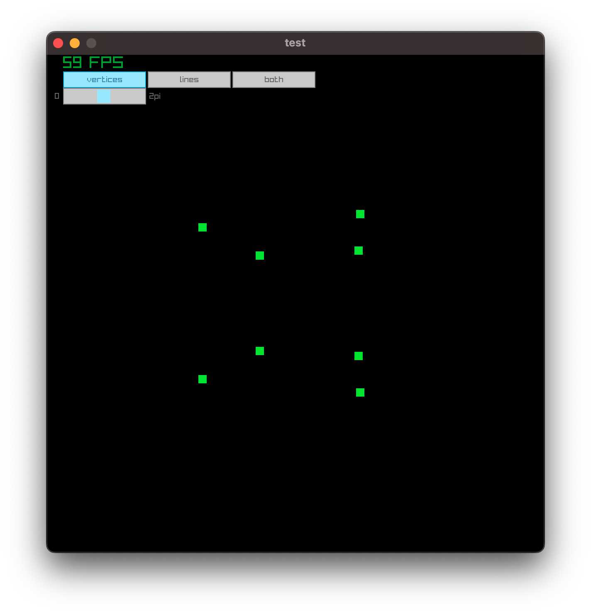
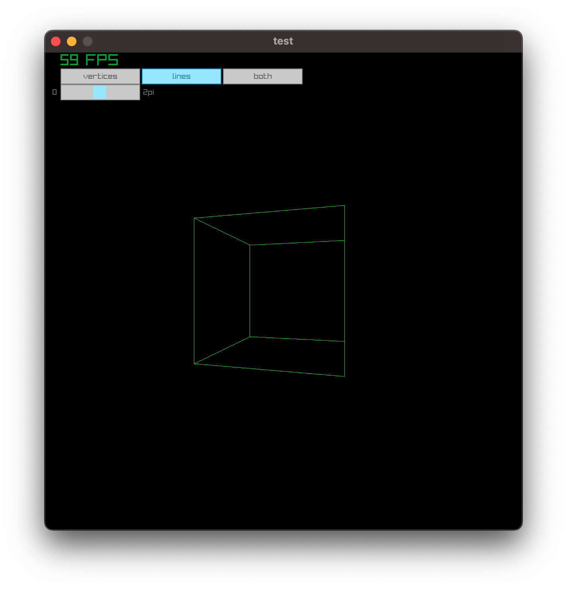
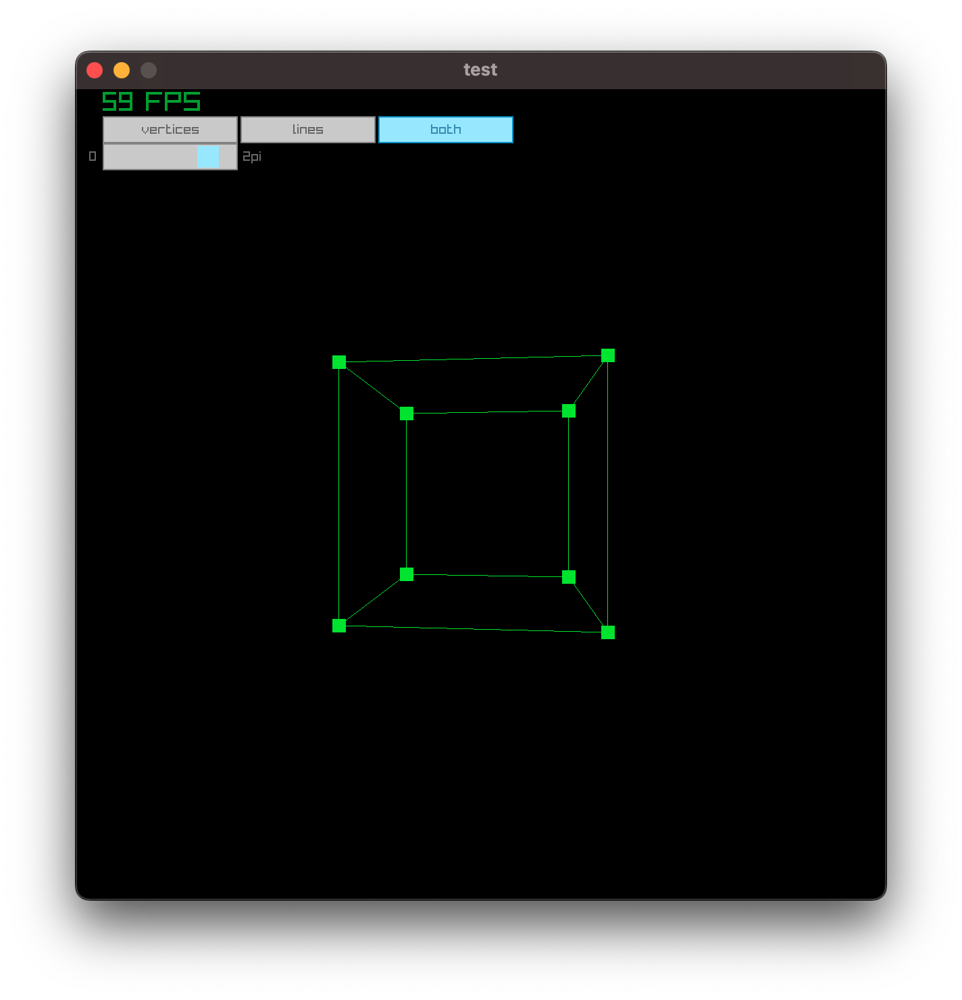
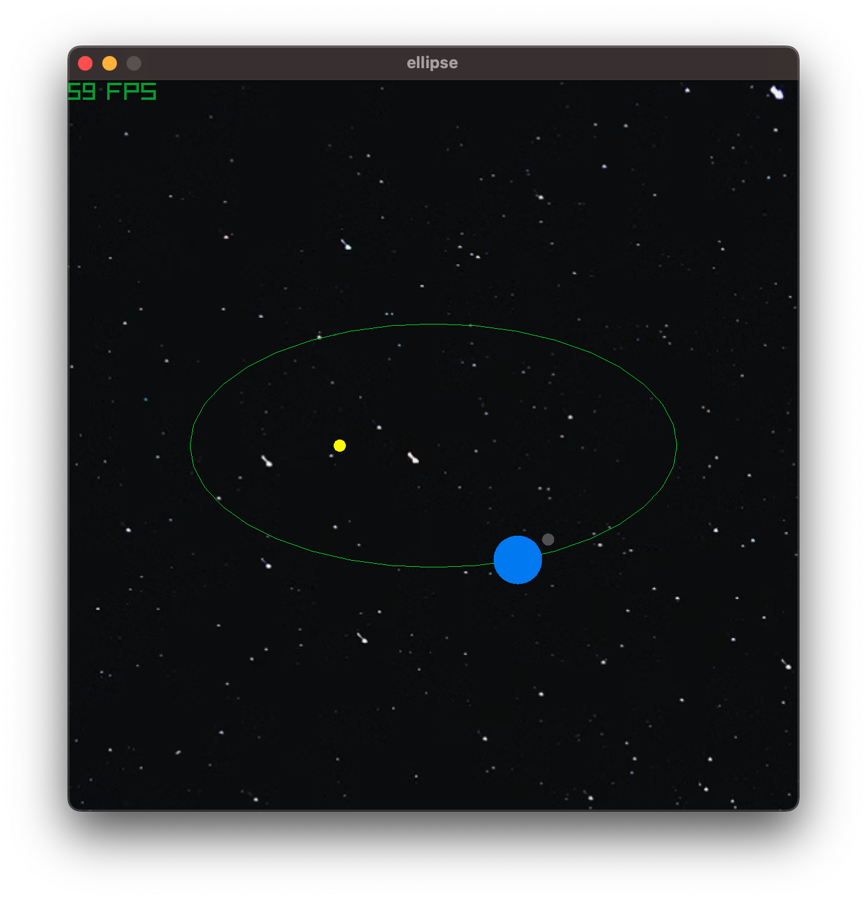

# raylib-projects
a collection of raylib app

This repo is meant to gather some of `raylib` scripts I've been doing as I'm still discovering this framework: https://www.raylib.com/

I'm using the `pyray python` bindings: https://electronstudio.github.io/raylib-python-cffi/pyray.html


## Simple Window
- a simple window display
```console
uv run projects/simple_window/main.py
```

<figure>

<figcaption>a basic window</figcaption>
</figure>
<!--  -->

## Moving ball
- trying keyboard input
```console
uv run projects/move_ball/main.py
```

<figure>

<figcaption>a moving ball</figcaption>
</figure>
<!--  -->

## 3D Rotating cube

- trying 3D
```console
uv run projects/3d_cube_camera/main.py
```
<figure>

<figcaption>a rotating cube</figcaption>
</figure>
<!--  -->

- looks like to apply a `rotation` to an object, I should use `pr.draw_model_ex` function so the `mesh` needs to be define before
- the (high level) structure of a `raylib` app :
1. define window
2. loop (= 1 frame):
    - define the app logic
    - start drawing
    - start camera
    - draw elements of your app
    - clear the frame buffer
    - close camera
    - close drawing
3. close window
- I still don't understand why the bindings do not allow for type hints. For example, highlighting `pr.draw_cube_wires_v` shows the following definition:

```python
(function) def draw_cube_wires_v(
    position: Vector3 | list | tuple,
    size: Vector3 | list | tuple,
    color: Color | list | tuple
) -> None
Draw cube wires (Vector version).
```

so it's natural to instantiate this object like this in the script:

```python
pr.draw_cube_wires_v(position=pr.Vector3(-3,0,3), size=pr.Vector3(2,2,2), color=pr.BLUE) # not working
```

However it's returning the following error:

```console
Traceback (most recent call last):
  File "/Users/jonathanbouchet/WORK/RAYLIB_PROJECTS_GH/raylib-projects/projects/3d_cube_camera/main.py", line 27, in <module>
    pr.draw_cube_wires_v(position=pr.Vector3(-3,0,3), size=pr.Vector3(2,2,2), color=pr.BLUE)
    ~~~~~~~~~~~~~~~~~~~~^^^^^^^^^^^^^^^^^^^^^^^^^^^^^^^^^^^^^^^^^^^^^^^^^^^^^^^^^^^^^^^^^^^^
TypeError: _wrap_function.<locals>.wrapped_func() got an unexpected keyword argument 'position'
```

## Instantiate Rings
- trying some bouncing physics
- click anywhere within the window and it spawns a ring (random direction, random speed, inner and outer radius, random color)
    - the red line shows the direction (was for debugging but I left it)
- the bouncing part is done but checking the position of the ring with the screen borders: if true, the direction are reversed
```python
if (
    self.pos.x >= (setting.WINDOW_WIDTH - self.outer_radius)
        or self.pos.x <= self.outer_radius
    ):
        self.direction.x *= -1
    if (
        self.pos.y >= (setting.WINDOW_HEIGHT - self.outer_radius)
        or self.pos.y <= self.outer_radius
    ):
        self.direction.y *= -1
```
- organize the code into classes; `Game` is its own class so when calling `game.run`, the full `raylib` process is done
- the top left counter keeps track of the number of rings instantiated

```console
uv run projects/instantiate_rings/main.py   
```

| Start | running |
| :---: | :---: |
|  |  |

## 3d collisions check
- motivation: collision detection for 3d objects
- raygui: [https://github.com/raysan5/raygui](https://github.com/raysan5/raygui)
- both player and the obstacle to collide with are `cube mesh`
- the collision is checked using the `pr.check_collision_boxes` function
- when true, a `raygui textbox` is drawn and color of the obstacle changes

```console
uv run projects/3d_collisions_check/main.py   
```

| no collision | collision |
| :---: | :---: |
|  |  |


## `raygui` icons
- motivation: gui icons manipulation / raygui
- raygui: [https://github.com/raysan5/raygui](https://github.com/raysan5/raygui)

```console
uv run projects/raygui_icons/main.py   
```

| all icons | icon pressed |
| :---: | :---: |
|  |  |

## tsoding
- motivation: reproduce [tsoding's video](https://www.youtube.com/watch?v=qjWkNZ0SXfo&t=7s) where a cube is rendering with simple math tools (amazing video)

```console
uv run projects/tsoding/main.py   
```

| no wireframe| wireframe only | both |
| :---: | :---: | :---: |
|  |  |  |


<!-- | cube no wireframe | cube wireframe |
| :---: | :---: |
| <video src="https://github.com/jonathanbouchet/raylib-projects/blob/main/docs/tsoding_recording.mov" width="75%" controls></video> | <video src="https://github.com/jonathanbouchet/raylib-projects/blob/main/docs/tsoding_recording_wireframe.mov" width="75%" controls></video> | -->

## Raycast
- ~~*work in progress: TO DO: multiple BBox**~~
- idea is to display when a raycast hits an object. 
- The initial test was using `pr.draw_line` to represent the ray and use `pr.check_collision_lines` to check collisions between the ray (as a line) and the 4 lines forming a rectangle
- using `pr.Ray` simplifies a bit the logic

| 1 box| multiple boxes|
| :---: | :---: |
|  |   |

- code ended a bit messy to associate ray, bboxes and whether or not there are collisions so next step is to improve it
- in short: now it shows the ray as green, with the collision point, no ray (red nor green) for ghost collisions. When a ray does not collide with a BBox, the ray is shown as red

## Solar System 

- not at scale (both space and time)
- default: earth's revolution around the Sun is done in 30s
    - the slider can increase by a factor 2 (max) or decrease the speed
- Moon's revolution around the earth is hard-coded
- *TO DO*:  
    - refactor to have both the Sun, Earth and Moon derive from a given class
    - add other planets (?)
    - 3D to show excenticity of ellipse 

| no background| deepsky texture|
| :---: | :---: |
|  |   |
