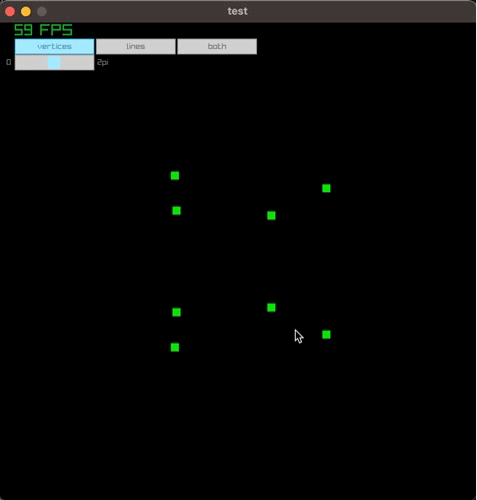

# raylib-projects
a collection of raylib app

This repo is meant to gather some of `raylib` scripts I've been doing as I'm still discovering this framework: https://www.raylib.com/

I'm using the `pyray python` bindings: https://electronstudio.github.io/raylib-python-cffi/pyray.html

## Projects
- `Simple Window`: a simple window display
- `Moving ball`: trying keyboard input
- `3D Rotating cube`: trying 3D
- `Instantiate Rings`: trying some bouncing physics
- `3d collisions check`: motivation: collision detection for 3d objects
- `raygui icons`: gui icons manipulation / raygui
- `tsoding`: reproduce [tsoding's video](https://www.youtube.com/watch?v=qjWkNZ0SXfo&t=7s) where a cube is rendering with simple math tools (amazing video)
- `Raycast`: idea is to display when a raycast hits an object. 
- `Solar System`: a 3D view of the Solar System
- `Load Blender`: a simple Blender mesh loader/viewer
- `To-do app`: a to-do app with a fastapi backend; `raylib` is used as frontend
- `breakout`: a `breakout` game`
- `rubikscube`: a 3D cube rotating by using widgets ; using quaternion
- `character_animation`: template for a basic character movement 
- `character_state_ai`: a small app to show case player/object detection and patrol-style movement for enemies 
- `grid`: a demo to showcase pathfinders algorithm; using a grid system
- `map_loader`: integration of maps created with Tiled (texture, Collisions layers)
- `bouncing_ball`: a demo to show physics with RAYLIB, ie, collision (inelastic, elastic) of a ball with objects
- `physics`: same idea as `bouncing_ball` but using [pymunk](https://www.pymunk.org/en/latest/) (pythonic 2D physics library)

# src/
- Added some re-usable systems ; idea is to make a library of these `utils` that I can quickly plug in for game development

```bash
├── Button.py # template for a toggle button 
├── animation_texture.py # template for animation based on tile
└── static_body.py # template to add a pymunk STATIC body based on a raylib definition
└── template.py # tempplate for a base app
```


# tests
- from the `projects` folder
- right now only `solar_system` has classes that can be tests
```bash
python -m pytest -rA
```

# Documentation
```bash
mkdocs build
mkdocs serve -a localhost:8001
```

# Launcher
- added a `tkinter` window to start the apps
```python
uv run launcher.py
```

# Demo
## Tsoding
