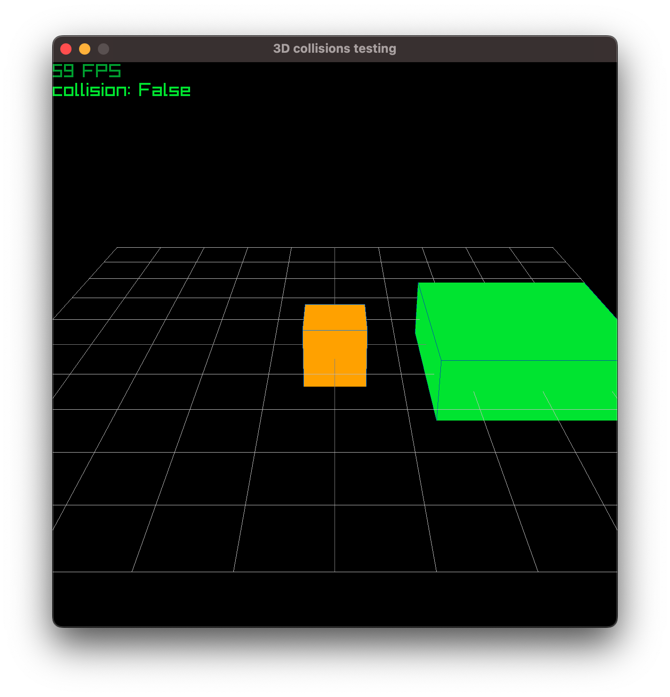
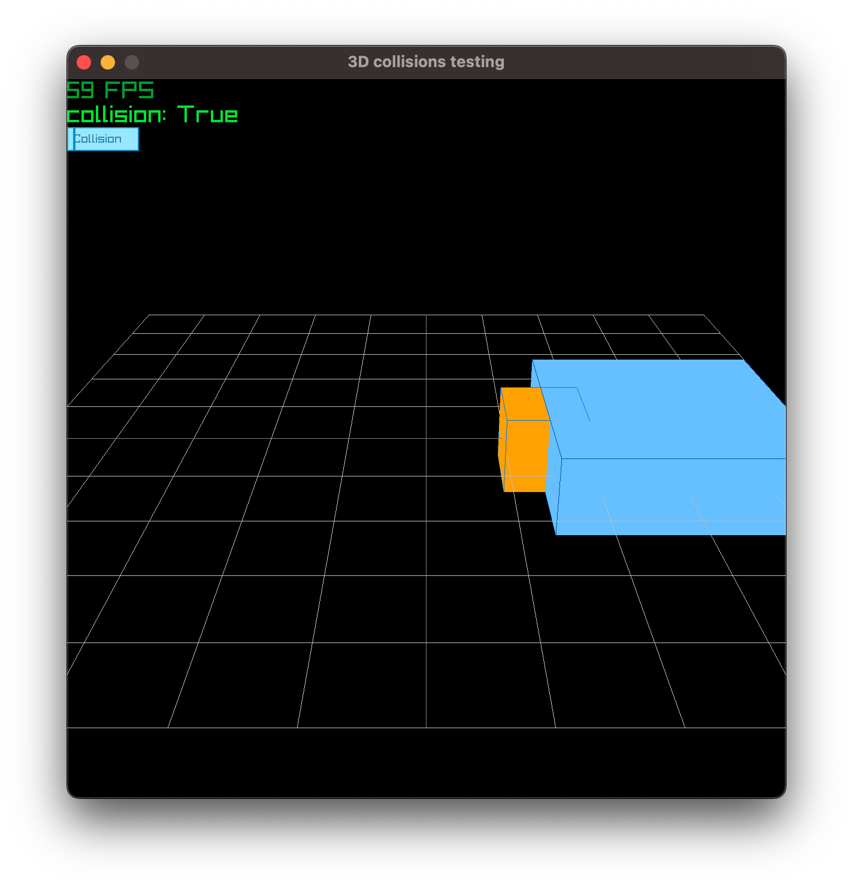

- motivation: collision detection for 3d objects
- raygui: [https://github.com/raysan5/raygui](https://github.com/raysan5/raygui)
- both player and the obstacle to collide with are `cube mesh`
- the collision is checked using the `pr.check_collision_boxes` function
- when true, a `raygui textbox` is drawn and color of the obstacle changes

```bash
uv run projects/3d_collisions_check/main.py   
```

| no collision | collision |
| :---: | :---: |
|  |  |
