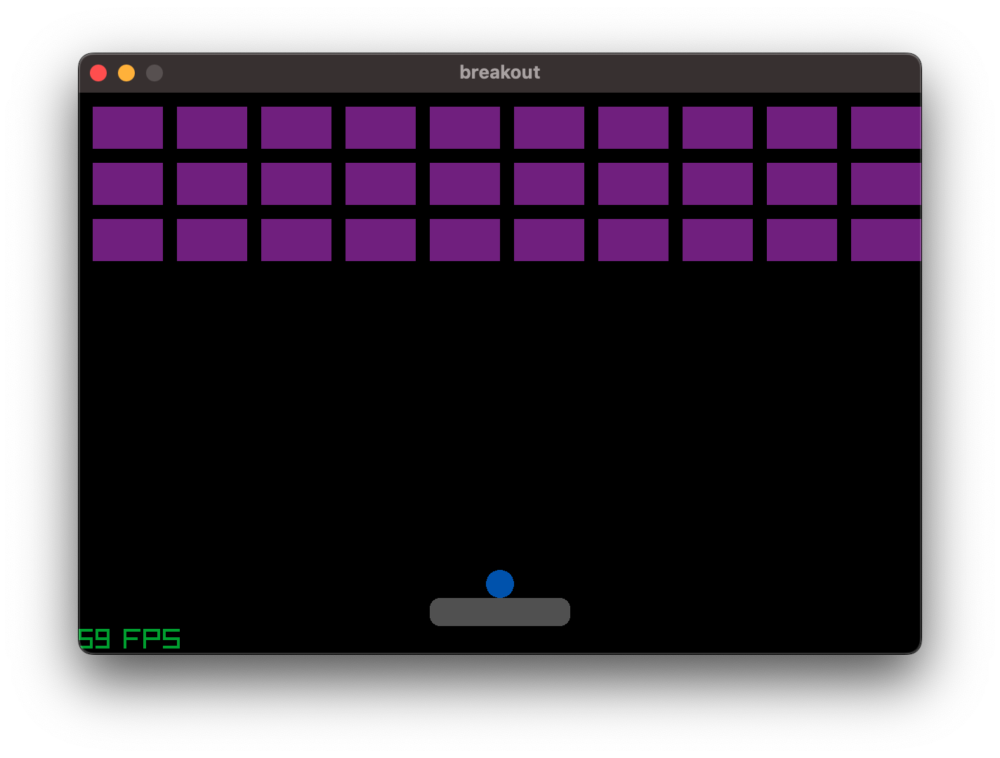
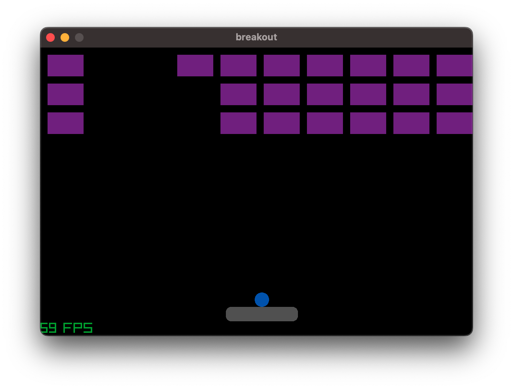

- a very basic `breakout` game
- `Bricks`: 
    - list of `brick`
    - TO DO: add `strength` so that only a second collision of the ball will destroy the brick
- `Ball`:
    - collisions are checked for top, left and right wall. When it occurs, the `direction` of the ball is reversed

    ::: projects.breakout.utils.Ball.move
        handler: python
        <!-- options:
        members:
            - move -->
        <!-- show_root_heading: True -->
        show_source: True

- `Player`

## TO-DO

## How to run

```bash
uv run projects/breakout/main.py   
```

<!-- ::: projects.utils
    handler: python
    options:
      members:
        - Sprite
        - Player
        - Ball
        - Brick
        - Brick
      show_root_heading: True
      show_source: True -->

| Start | running |
| :---: | :---: |
|  |  |
