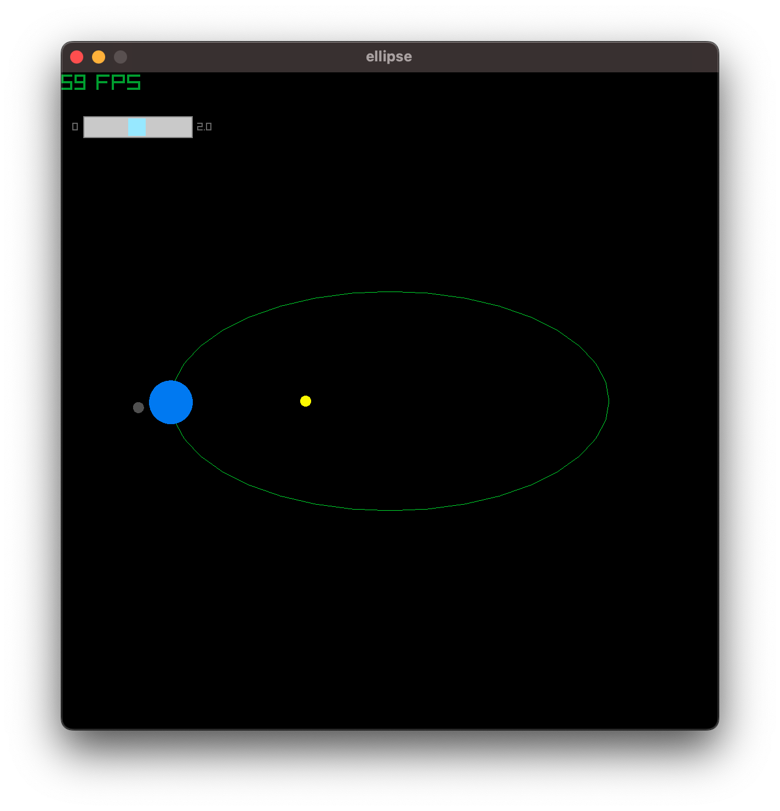
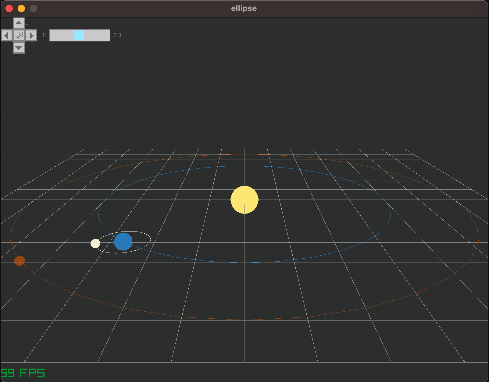

- not at scale (both space and time)
- default: earth's revolution around the Sun is done in 30s
    - the slider can increase by a factor 2 (max) or decrease the speed
- Moon's revolution around the earth is hard-coded
- *TO DO*:  
    - ~~refactor to have both the Sun, Earth and Moon derive from a given class~~
    - add other planets [WIP]
    - 3D to show excenticity of ellipse [WIP]

```bash
uv run projects/solar_system/main.py 
```

| 2D|3D|
| :---: | :---: |
|  |   |

- 3D version:
    - initial version
    - camera can be moved with keyboard but needs improvement
    - overall code needs refactoring
    - all satellites are orbiting in the same plan, which is not the case

::: projects.solar_system.stellar_objects
    handler: python
    options:
      members:
        - Body
        - Star
        - Planetoid
      show_root_heading: True
      show_source: True