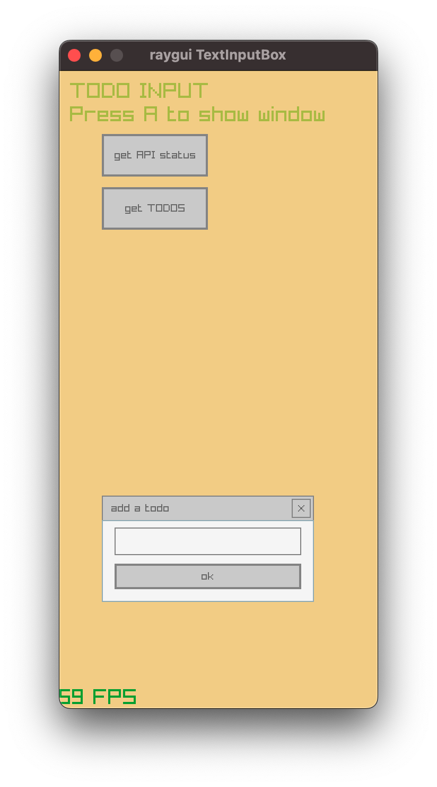
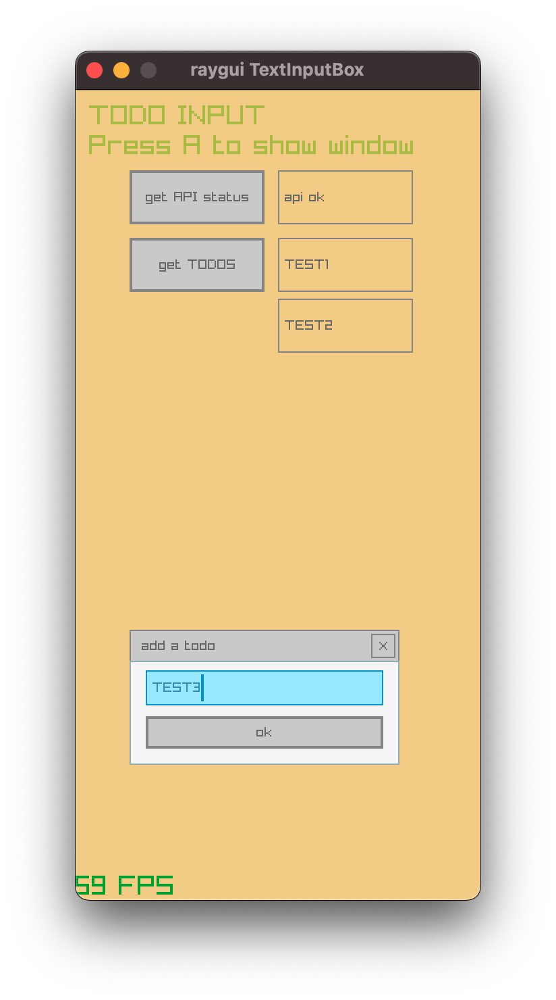
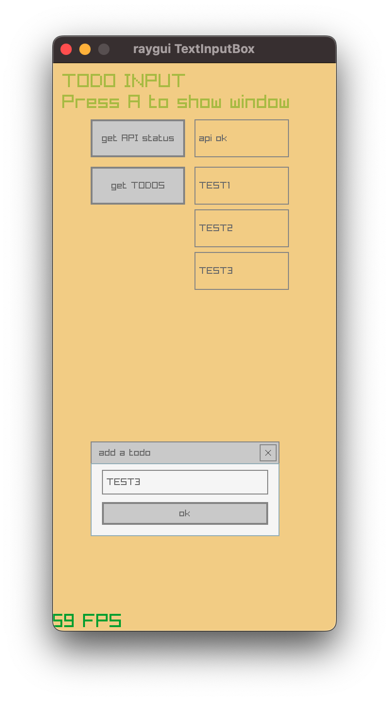

- the idea is to reproduce a simple REST API where the backend (`fastapi`) could get request from the frontend(`raylib`) 
- work in progress 
- run backend:
```bash
uvicorn projects.todo_app.app:app
or
uv run uvicorn app:app --host 0.0.0.0 --port 8000
```
- no SQL database, for now the `todo` are just in memory
- run frontend:
```bash
uv run projects/todo_app/main.py
```

| start| adding a todo| getting list of todos |
| :---: | :---: | :---: |
|  |  |  |


## backend
::: projects.todo_app.app
    handler: python
    options:
      members:
        - app
        - ToDo
        - ToDoUser
      show_root_heading: True
      show_source: True
