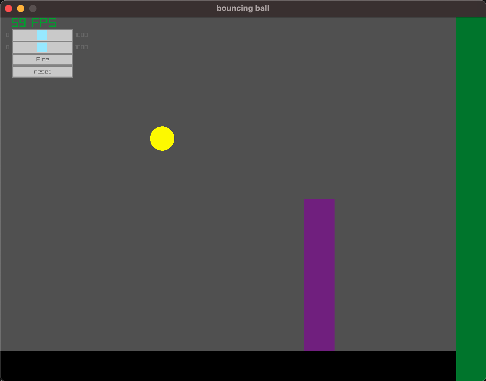
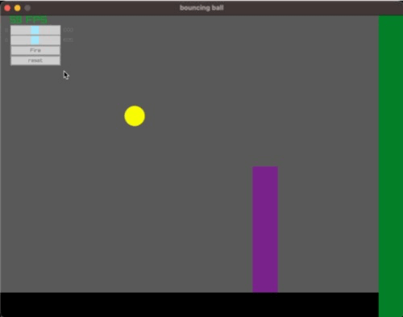

## Motivation
- doing some physics with RAYLIB, ie, collision (inelastic, elastic) of a ball with objects

<figure>

<figcaption>in game</figcaption>
</figure>

<figure>

<figcaption>animated gif</figcaption>
</figure>
