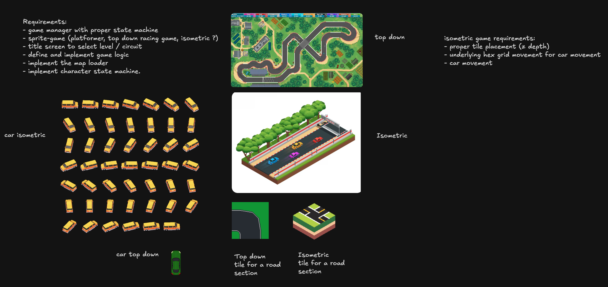

# (pre) 2026-07-17
## result on brainstorming

## Overview

The game will be a pixel art car driving simulator. The user selects a tile on a map and the car asset moves towards this tile. 

Requirements:

- The game will be using an isometric perspective
- tile’s selection using mouse
- games needs menu screen
- assets done by me (no itch.io)

The development planning has 3 phases:

1. system prototyping
2. adding top down assets
3. replacing top down assets with isometric assets

### Phase 1

- reusing the `grid` project where I made a `Board` to show the pathfinder algorithm: https://github.com/jonathanbouchet/raylib-projects/tree/main/projects/gridGame
- Game screens:
    - a title screen with 2 buttons:
        - a `generate` button that will place walkable and obstacle tile
        - a `settings` button that will redirect to the `settings` screen
    - a settings screen:
        - only option is the grid size, ie `20x20` tiles, `40x40` tiles
            - numbers TBD
        - once the choice is confirmed, it goes back to the title screen
    - the `play` screen that will show the player, the walkable and obstacle
        - mouse is enable to click on any walkable tile
        - then the player moves to this selected tile
- the screens buttons and text should be done with `PixiEditor`
- re-using the `ResourceManager` from the twin-stick shooter: https://github.com/jonathanbouchet/raylib-projects/tree/main/projects/twin_stick
- to implement: the `game manager` to switch between screens
- the walkable, obstacles and player assets also done with `PixiEditor`
- I don’t plan to re-use the `map loader` project: https://github.com/jonathanbouchet/raylib-projects/tree/main/projects/map_loader because the tiles are placed by code

### Phase 2

- in this phase I replace the walkable, obstacles tiles with the `road` top dow assets
- the player, now a car, will need to handle `texture` rotation when turning
- to implement: replace random generation of tiles with `Cellular Automata` algorithm to match road segments
    - → need research

### Phase 3

- in this phase I replace the top down assets with the isometric ones
- the movement of the player will still follow a `grid` based mechanism, only the rendering changed for the isometric tile
    - re-use the `isometric map` project: https://github.com/jonathanbouchet/raylib-projects/tree/main/projects/isometric_map

### Art work

- grass and rocks:
    - design: https://www.slynyrd.com/blog/2023/3/26/pixelblog-43-top-down-tiles-part-2
    - palette: https://lospec.com/palette-list/overgrowth
    - character: https://www.sandromaglione.com/articles/pixel-art-top-down-game-sprite-design-and-animation
