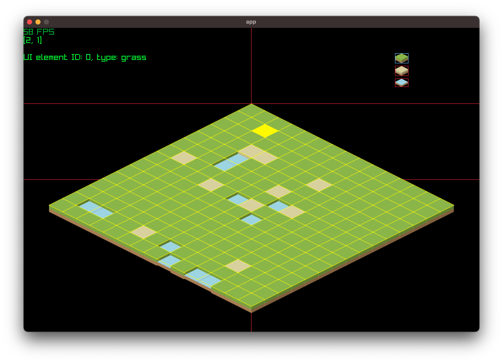
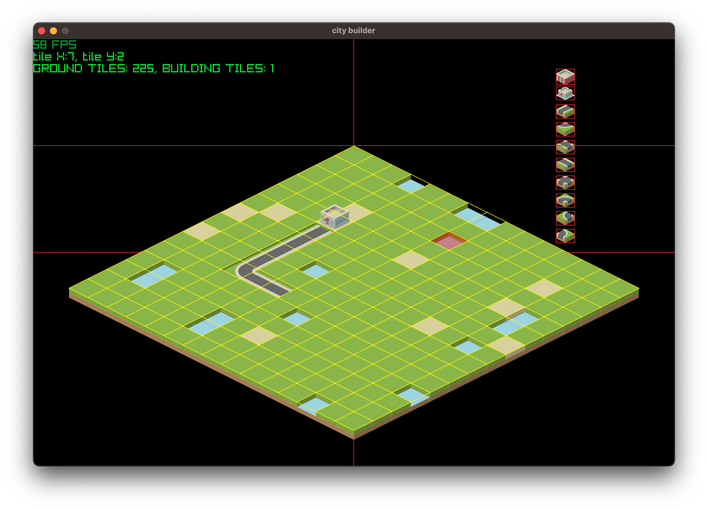
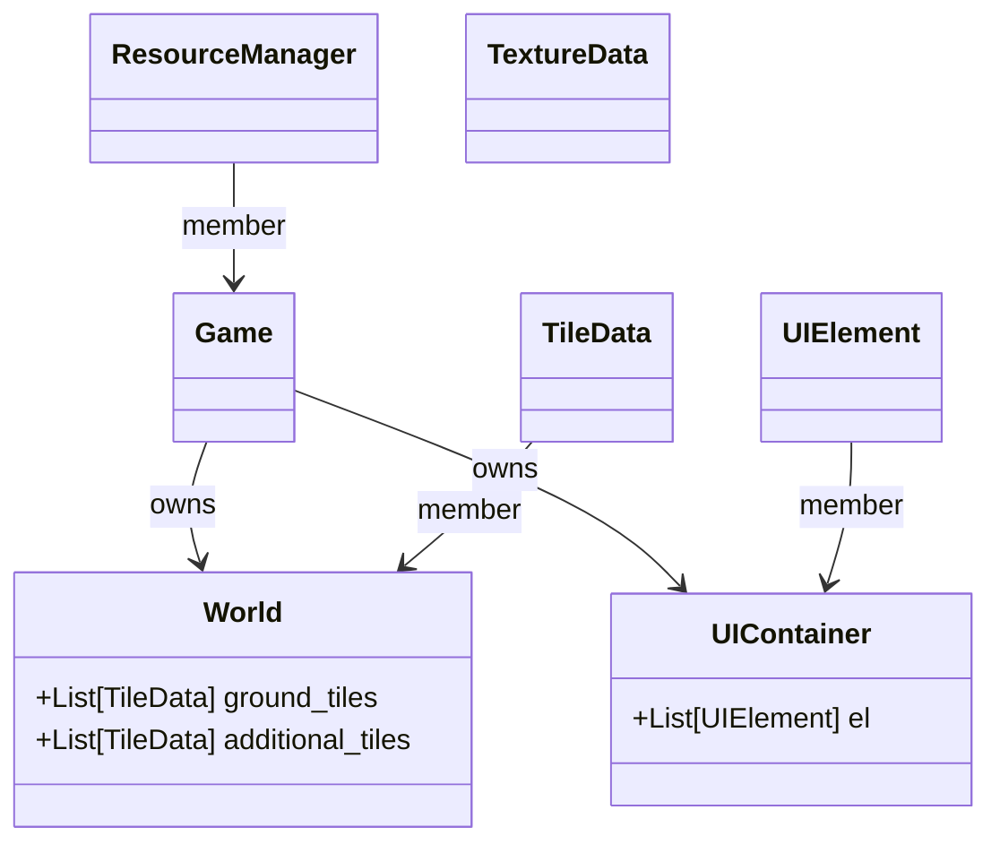

# Intro

This project is the continuation of other project / game ideas started few weeks ago, namely a [pixel art car driving simulator](https://github.com/jonathanbouchet/raylib-projects/blob/main/projects/car_sim/DEVLOG.md).

At the same time I was experimenting with map and UI: [here](https://github.com/jonathanbouchet/raylib-projects/tree/main/projects/isometric_map), [here](https://github.com/jonathanbouchet/raylib-projects/tree/main/projects/isometric_map_ui) and [here](https://github.com/jonathanbouchet/raylib-projects/tree/main/projects/clickable_map)

# Dev
## 2026-07-24

- current status is shown below:

### Systems in place
- isometric map: can change tile's size
- textures: assets taken from [Kenney](https://kenney.nl/assets)
    - also working on my own assets
- clickable tile
- UI: intaction/detection of mouse to select a tile
- camera (not shown here): can move the top up/down, left/right

### Systems to do
The full idea of the game is not yet flushed out, hesitating between a building game (the player assembles the map), or a sim game (the player starts with a predefined map and manages assets).
This is somehow an issue because it drives the map design (# of tiles, size, UI)

As of right now, I'm working on the above to integrate these other systems: 

- [ ] Resource manager
- [ ] Multiple game screens
- [ ] Loading predefined maps
- [ ] Assets placement on the map

### Game Mechanics
- **placeholder**

## 2026-07-31
- current status:

- features:
    - can add road tile and building tile (!)
    - prevent to add any new tile on tile flagged as `is_buildable` False (water tile and a new building)

