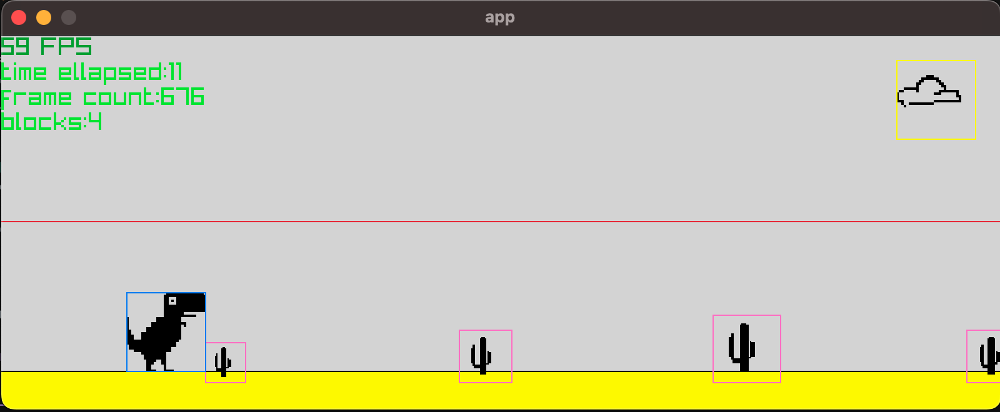

# Notes
This file is just to document the day to day development

## 2026-06-13
- prototyping with moving shapes
- red line is to show the mid `game window`, the gray line the floor
- rectangles with random `height` are spawned every second with a given probability (`0.95`) in the snipped below:

```py
while not pr.window_should_close():
    # logic
    dt = pr.get_frame_time()
    frame_counter += 1
    run_time = pr.get_time()
    if frame_counter % 60 == 0: # spawn a block every frame
        if random.random() < 0.95:
```


<!--  -->

# 2026-06-14
- modified `game window` and `color` to reflect the original game
- adding dino texture
- adding collision shape debug
- the collision of the player with the moving shapes is evaluated at each frame:

```py
# player class #
def get_rectangle(self) -> pr.Rectangle:
        return pr.Rectangle(self.position.x, self.position.y, self.texture.width, self.texture.height)
    
    def update(self, dt: float, other: pr.Rectangle) -> None:
        self.move(dt=dt, other=other)

    def check_collisions_enemies(self, enemies: list[pr.Rectangle]):
        for enemy in enemies:
            if pr.check_collision_recs(self.get_rectangle(), enemy):
                print(f"{enemy.width}, {enemy.height}, {type(enemy)}")
                print("COLLISION")

# game loop #

# updates all blocks
_ = [block.update(dt=dt) for block in block_list]

# update player
player.update(dt=dt, other=floor_rect)
player.check_collisions_enemies(enemies=[x.get_rectangle() for x in block_list])
```
- during the game loop, each moving rectangles are appended to a list.
- only rectangles on the screen are appended to the list and they are disabled if their `x-position` is < 0

```py
 # draw block
    _ = [block.draw(dt=dt) for block in block_list if not block.disable]
```


# 2026-06-15
- more textures tweaking: 
    - indeed initially the cactus shape was `32x32` (drawn) then upscaled to `64x64` (simply because it's easier to draw a `32x32`)
    however, I defined the collision shape using the texture size so it created so extra empty space, biasing the collision
    - redid the png as `12x32` so now the collision shape fits the width of the cactus 



- added game stop when collisions


- cactus can be spawned with variable heights:

```python
cactus = Cactus(
    texture=cactus_texture, 
    position = pr.Vector2(width, height - int(cactus_texture.height) - 20), 
    speed=200, 
    color=pr.WHITE,
    scale=random.uniform(0.8, 1.4),
    debug_color=pr.PINK)
```