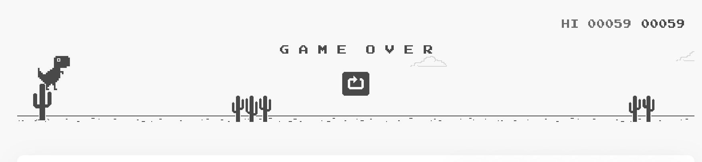
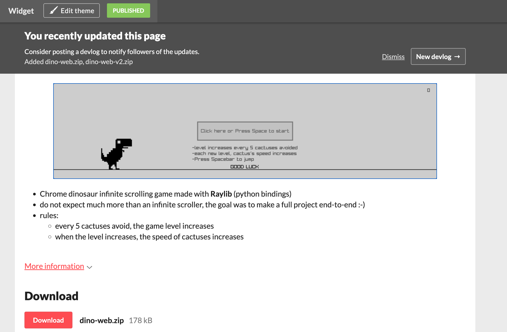

# Motivation
The goal is this project is to reproduce the [Chrome dinosaur game](https://dinosaur-game.io/) as much as I can.

# Update
The game is deployed on `itch.io`:

[https://jonathanbouchet.itch.io/dino-game](https://jonathanbouchet.itch.io/dino-game)

# Overall plan of action
- [ x ] test the original game and get requirements such as window size, type of assets, game play
- [ x ] prototyping moving shapes (left <-- right), shapes (position, random shape size)
- [ x ] assets pixel arts using [pixieditor](https://pixieditor.net/) ; test assets in game (maybe resizing if neede)
- [ x ] coding gameplay, such as collision detection and props display (cloud)
- [ x ] replace objects with textures
- [ x ] add gameplay elements: scoring, pause/restart

# Notes
See NOTES.md for dev log

# Thoughts / What I learned
- the first phases `prototype` -> `game` went well.
-  although the game is quite simple, no major coding issues
- improvements: 
    - the `Game` class rapidly became quite big. I need to figure a better way to do that (maybe add sub classes that will keep track of a certain type of variables, like those for `score`, those for `objects`, `textures`)
    - plan in advnace the features: I often wanted to add a new feature that required some changes (refactoring)
    - plan in advance how to debug `objects`, i.e adding `flag` to quickly enable/disable these debugging infos
    - be consistent in naming conventions for `texture` vs. `texture_path`
    - documentation / comments !!!
    - use State machine more widely