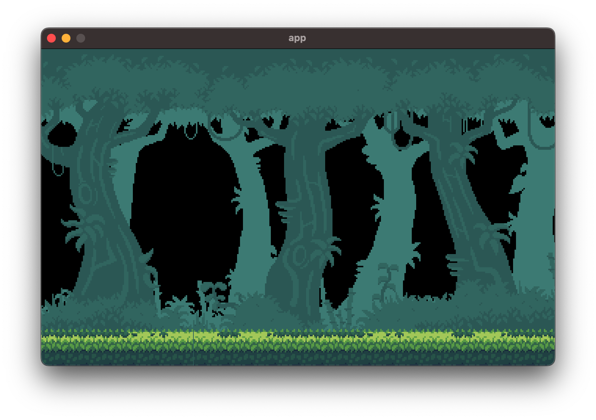

## Motivation
- add dynamic background
- 2 components in this app:
    - infinite scrolling background
    - elements of background give a feeling of parallax 

## How
- infinite scrolling: a given texture is loaded multiple times, so that when a texture moves outside the game window, it is re-positioned at the beginning of the queue
- parallax: png are drawn given z-order and at different scrolling speed

<figure>

<figcaption>animated gif</figcaption>
</figure>
