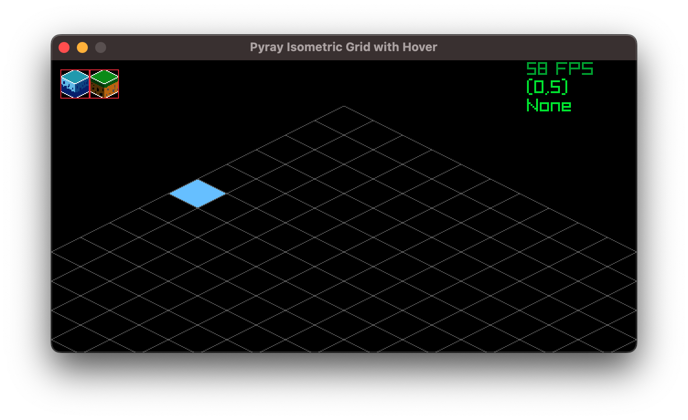
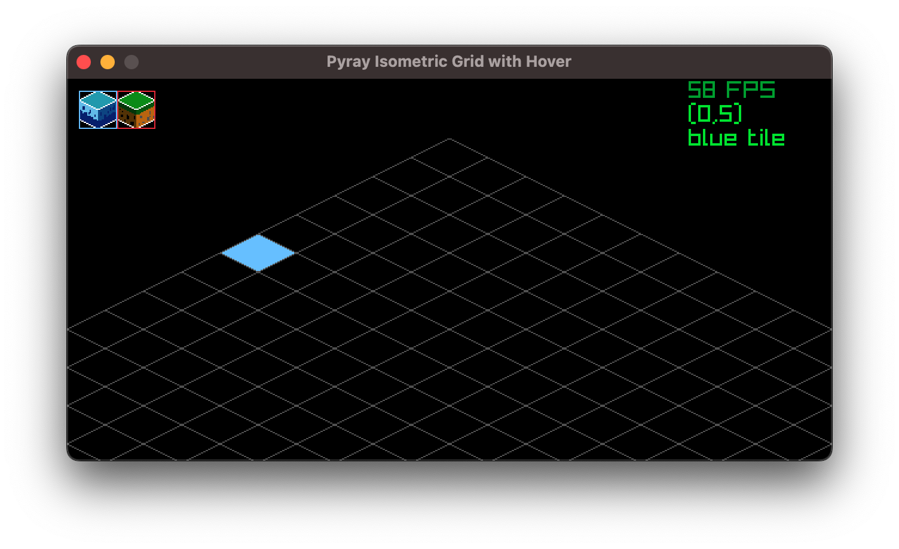

## Goal

- This project is to build a `UI` for my (future) isometric city builder game
- right now the same `texture` is used for both the `UI` (top left) and the amp itself (only rescale to `32x32` in the `UI`)
- flow: 
    1. select a tile from the `UI`
    2. hoverlay / select the tile on the map on which you want to place the tile. When a tile is selected, its outline changes to blue
    3. TO DO: add the tile to a map Class

<figure>

<figcaption>no tile selected</figcaption>
</figure>

<figure>

<figcaption>blue tile selected</figcaption>
</figure>