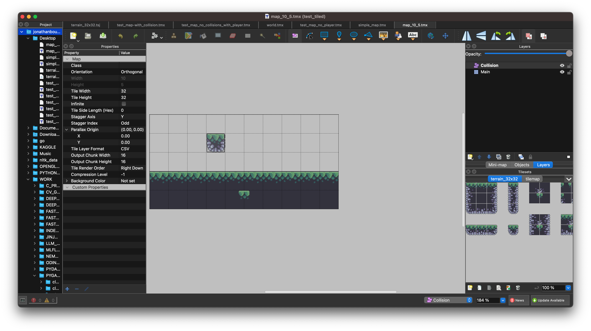
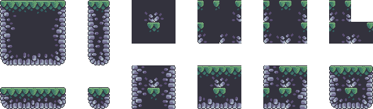
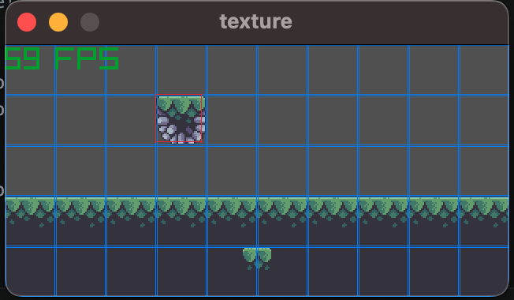
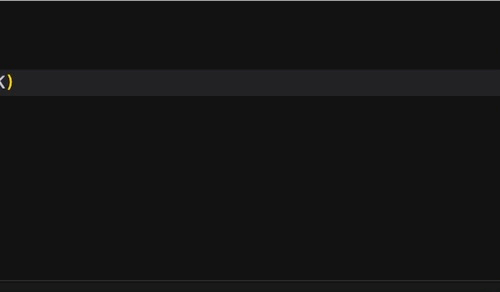
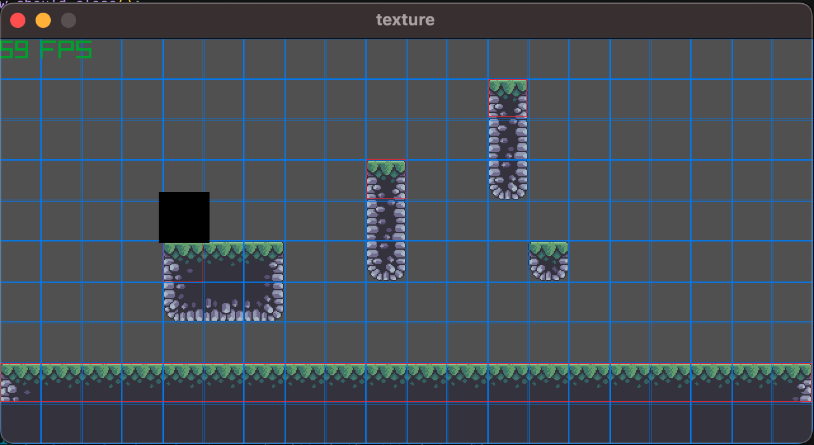

## a texture / map loader

- I used the [Tiled](https://www.mapeditor.org/) map editor to create map

<figure>

<figcaption>map data (.tmj)</figcaption>
</figure>

- The map is saved as `.tmj` format, which is a JSON format
example:

```bash
{ "compressionlevel":-1,
 "height":5,
 "infinite":false,
 "layers":[
        {
         "data":[0, 0, 0, 0, 0, 0, 0, 0, 0, 0,
            0, 0, 0, 73, 0, 0, 0, 0, 0, 0,
            0, 0, 0, 0, 0, 0, 0, 0, 0, 0,
            2, 2, 2, 2, 2, 2, 2, 2, 2, 2,
            19, 19, 19, 19, 24, 25, 19, 19, 19, 19],
         "height":5,
         "id":1,
         "name":"Main",
         "opacity":1,
         "type":"tilelayer",
         "visible":true,
         "width":10,
         "x":0,
```
- Tiles will be on the `main` layer (you can change the name) but you can also define any other type of layer, like `collision`, or `object placement`
- The `data` key gives the `ID` of the `Tileset` (the png file with your assets)

<figure>

<figcaption>tiles asset</figcaption>
</figure>

- this version just decodes the `.tmj`
- [ x ] : to do: include the `collision` layer
- [   ] : to do: decode `Player` layer

### In-game pictures

<figure>

<figcaption>in game</figcaption>
</figure>

- in blue: debugging grid to show the texture tiles layer
- in red: debugging grid for the collision layer
   - note: there is some shift in the position due to conversion of `float` to `int` required by `pr.Rectangle`

<figure>

<figcaption>animated gif</figcaption>
</figure>

- the black square is (supposed to be) a player

#### Other pictures with another (larger) map

<figure>

<figcaption>in game</figcaption>
</figure>

<figure>

<figcaption>animated gif</figcaption>
</figure>
 
### Notes
- I tried to have the game window defined by the map, ie as the `Tiled` map is loaded, it contains the original `width` and `height`
- so my idea was to instantiate the MapLoader class first, then do `raylib`'s boilerplate (`initwindow`, `setframe`)
- however it seems that `init_window` needs to be called before any attempt to load a texture