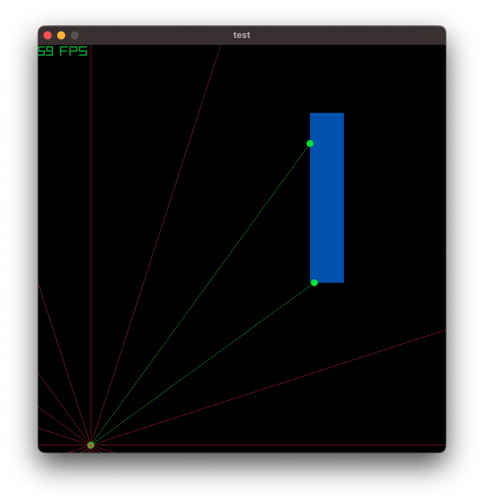
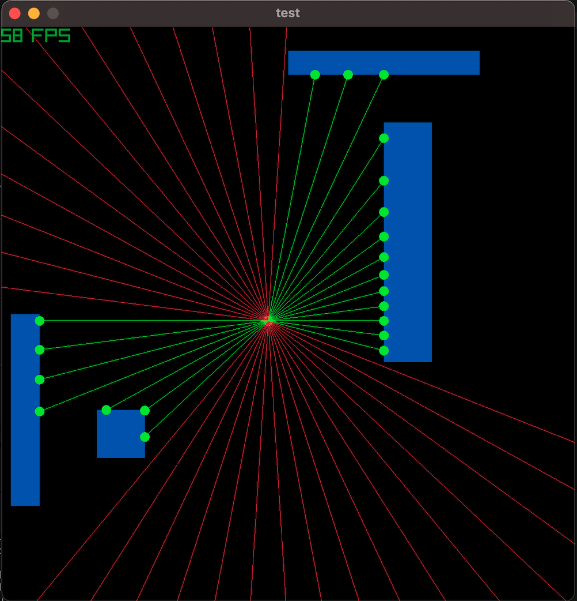

## Raycast
- ~~*work in progress: TO DO: multiple BBox**~~
- idea is to display when a raycast hits an object. 
- The initial test was using `pr.draw_line` to represent the ray and use `pr.check_collision_lines` to check collisions between the ray (as a line) and the 4 lines forming a rectangle
- using `pr.Ray` simplifies a bit the logic

```console
uv run projects/raycasting/main.py   
```

| 1 box| multiple boxes|
| :---: | :---: |
|  |   |

- code ended a bit messy to associate ray, bboxes and whether or not there are collisions so next step is to improve it
- in short: now it shows the ray as green, with the collision point, no ray (red nor green) for ghost collisions. When a ray does not collide with a BBox, the ray is shown as red
