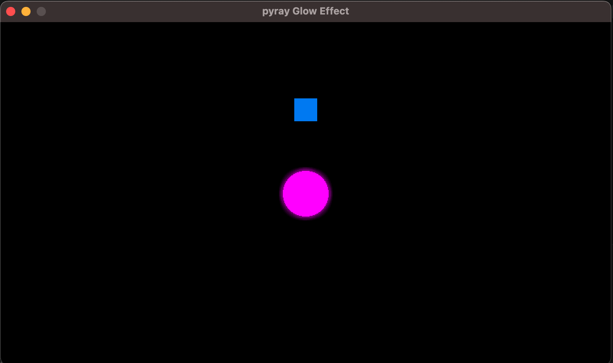

- This scriot shows how to apply a shader to a `raylib` primitive shape (Rectangle, circle)
- the idea is to apply the shader to the whole screen so all objects outside the `pr.begin_shader_mode(shader)` <--> `pr.end_shader_mode()` will not be affected by it
- note that the `game window` should match the definition in the shader file:

```py
# py game
pr.init_window(800, 450, "pyray Glow Effect")
```

```cpp
// shader file
const vec2 size = vec2(800, 450);   // Framebuffer size
```

