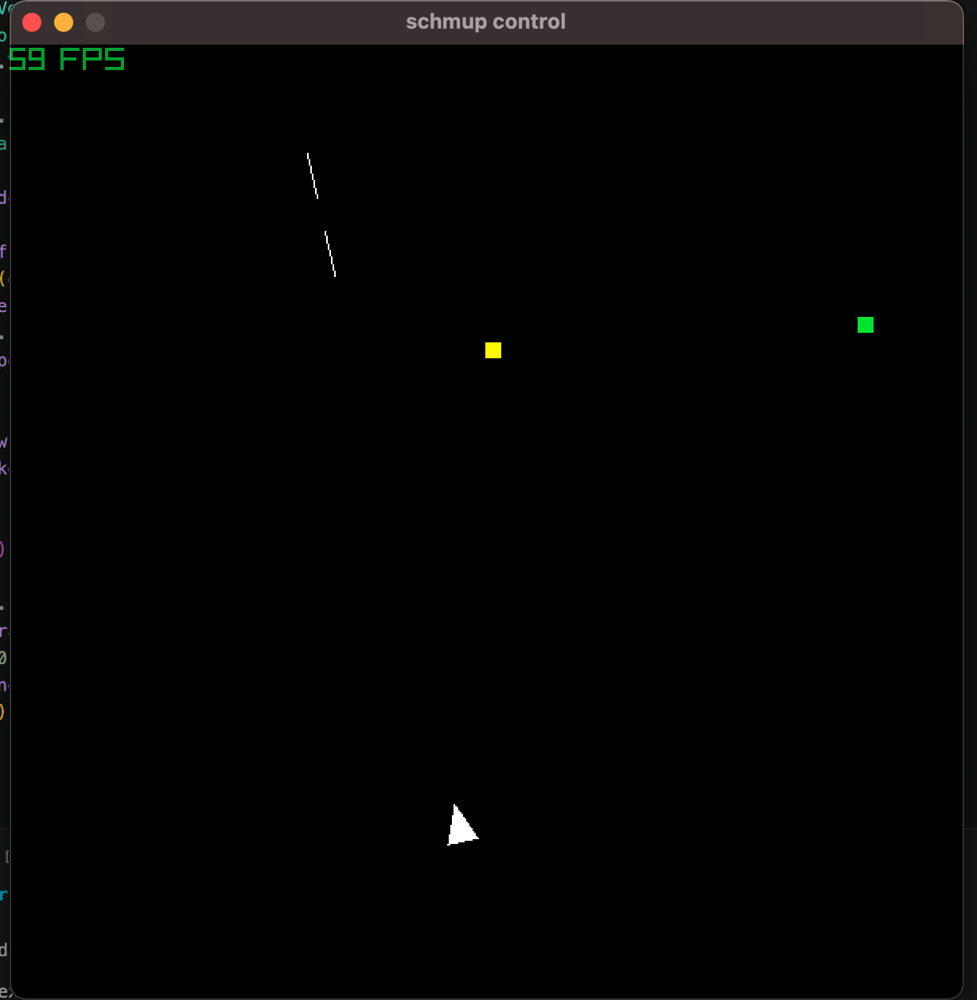
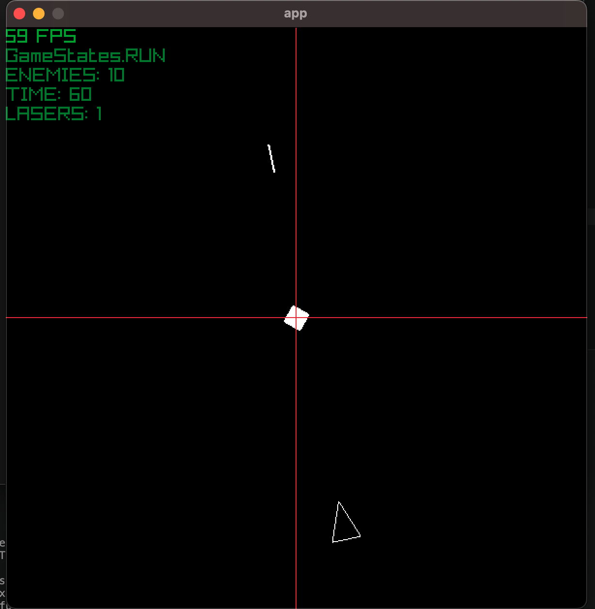
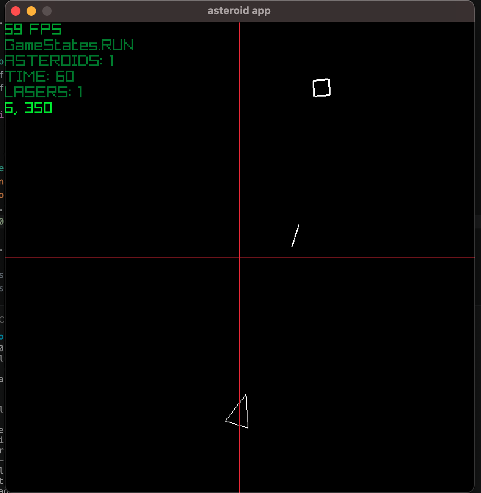

# Notes
This file is to document the day to day development

## 2026-06-20
- game idea: twin stick
    - game window: no collisions so that player re-appear on the other of the screen
    - player has thrust and drag to "simulate" space physics
    - gameplay: 
        1) either the time of each round is fixed but number of enemies increase
        2) the time decreases at each round but # of enemies remain fixed
    - game systems goal achievement: game manager, State Machine, animations 
    - nice to have: scrolling space background, shader to give a "tron" aesthetic  
 
## 2026-06-21
- prototype idea



- not decided yet on either to use a simple triangle shape or use a texture
- experimented with contols: 2 choices:
    1. mouse to click on the destination and `<-`, `->` for rotation, `space` to shoot
    2. `^`, `<-`, `->` for player control and `space` to shoot 
- worked on improving the separation of concerns for the game manager: the idea is to have to have the `GameManager` to take care only of the `game` variables, and have a `ResourceMAnager` to take care of the resources (textures, sounds)
    - in that case, I don't end up with an ever growing `GameManager` class

```python
resources_manager = ResourceManager(assets_path="./resources.json", image_loader=lambda p: pr.load_texture(p))
    player_texture = resources_manager.get_image("player_idle")
    game = GameManager(
        width=600, height=600, fps_target=60, name="app", background_color=pr.BLACK
    )

class ResourceManager:
    def __init__(self, assets_path: str, image_loader):
        self.assets_path = assets_path
        self.image_loader = image_loader
        with open(self.assets_path, 'r') as f:
            self.asset_cfg = json.load(f)
        self.images = {}   # key -> texture
        self.sounds = {}   # key -> sound

class GameManager:
    def __init__(
        self,
        width: int,
        height: int,
        fps_target: int,
        name: str,
        background_color: pr.Color,
    ):
        self.width = width
        self.height = height
        self.fps_target = fps_target
        self.name = name
        self.background_color = background_color
```

## 2026-06-23
- tiny reboot in this project as I was prototyping my game manager + resourcer class
- final idea is to stick with the original concept, i.e using `raylib` primitive shapes and not load any textures
- the goal of these `small game` is to make a contained experiment to work on a given feature
- Goal:
    - destroy all asteroids in the time allocated
    - if successful -> go to next wave:
        - at the begining of the next wave: 2 choices are presented to the player:
            1. increased number of enemies, same allocated time
            2. same number of enemies, decreased allocated time
- visuals:
    - player: triangular shape
        - laser: either a `line` or very fine `rectangle` (maybe the later is better for collision)
    - asteroids: rectangular shape:
        - add random rotation, speed and shape
        - can the asteroids be split into smaller ones after collision with laser ?
    - background: parallax using 1 layer of random rectangles scrolling down and another 1 layer with a slightly higher speed and shapes
        - use raylib primitive 



## 2026-06-24
- another change in the overall visual ; I plan to also change the asteroids to only rectangle, not filled shape
- collision laser-asteroid: this may be tricky because the laser is a `line` and the asteroid a `rectangle`. `Raylib` has a `check_coliision_point_rect` to check if a point is inside a rectangle but it may miss the collision if the laser travels too fast
- also I'm still not satisfied with the current inheritance from `Sprite` -> `asteroid` | `player`. At the end to want to have inheritance for the different classes makes things more complicated
- TO DO: resurrect the `ResourceManager` to define the `player` and other objects parameters. Right now this is still ugly:

```python
self.player = Player(
            position=pr.Vector2(self.width / 2, 500),
            window_size=pr.Vector2(self.width, self.height),
            v1=pr.Vector3(self.width / 2 - 15, 100 + self.height / 2, 0),  # bottom left
            v2=pr.Vector3(
                self.width / 2 + 15, 100 + self.height / 2, 0
            ),  # bottom right
            v3=pr.Vector3(self.width / 2, 100 + self.height / 2 - 40, 0),  # top center,
            speed=10,
            angular_speed=150,
            color=pr.WHITE,
            scale=1.0,
            debug=False,
            debug_color=pr.BLUE,
        )
```
but the original idea of the `ResourceManager` was to actually to take care of this. So I need to define a `JSON` from which the `ResourceManager` will read the parameter
- current status of the game:

```bash
├── NOTES.md
├── README.md
├── main.py
└── src
    ├── __init__.py
    ├── asteroid.py
    ├── game_manager.py
    ├── laser.py
    ├── player.py
    ├── proto.py
    ├── resource_manager.py
    ├── resources.json
    ├── scorer.py
    ├── sprite.py
    └── utils.py
```

## 2026-06-26



- refactoring again
- re-introduced the `ResourceManager`
- added `Asteroids` to game_manager and code for spawning waves of asteroid
- fixed Asteroid rotation: because this is now a raylib primitive shape, there's no method to draw a rectangle oultined and rotated. So instead I collect the 4 points of the asteroid and rotate in their local frame
- Laser: switch from Laser as a line to Laser = rectangle
- prototyped the collision detection: `pr.checks_collision_rects` works only for Axis-Aligned Bounding Boxes (AABB), not for Oriented Bounding Boxes (OBB)
    - got an OBB working but also found a py package doing the exact same thing: [polygoncollision](https://github.com/vertmit/PolygonCollision)
- the OBB method is using the Separating Axis Theorem  (SAT): The Separating Axis Theorem is a technique for solving convex polygon collision problems.  The Theorem postulates if a line can be drawn between two convex (and not concave) polygons the Polyhedra are not colliding.

Some related docs:
- https://code.tutsplus.com/collision-detection-using-the-separating-axis-theorem--gamedev-169t
- https://programmerart.weebly.com/separating-axis-theorem.html
- https://dev.to/pratyush_mohanty_6b8f2749/the-math-behind-bounding-box-collision-detection-aabb-vs-obbseparate-axis-theorem-1gdn

## 2026-06-29
- added resources for scorer, shaders and sync with existing codes; added switch to use shader
- added a start screen and associated gamestates logic; begin to update Scorer with asteroids destroyed [wip]
- added logic to discard laser and asteroid if collision
- the idea is to apply the shader to the whole screen so all objects outside the `pr.begin_shader_mode(shader)` <--> `pr.end_shader_mode()` will not be affected by it
- note that the `game window` should match the definition in the shader file:

```py
# py game
pr.init_window(800, 450, "pyray Glow Effect")
```

```cpp
// shader file
const vec2 size = vec2(800, 450);   // Framebuffer size
```

